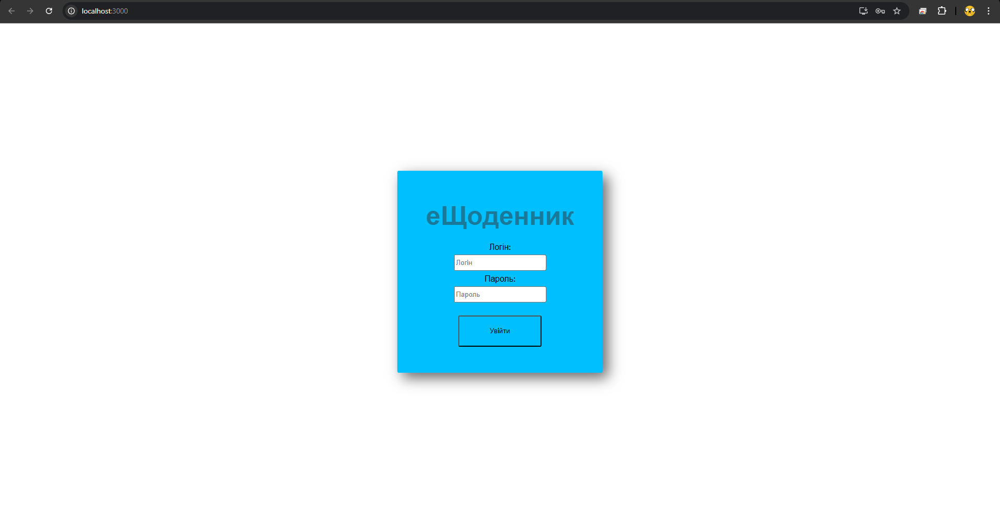
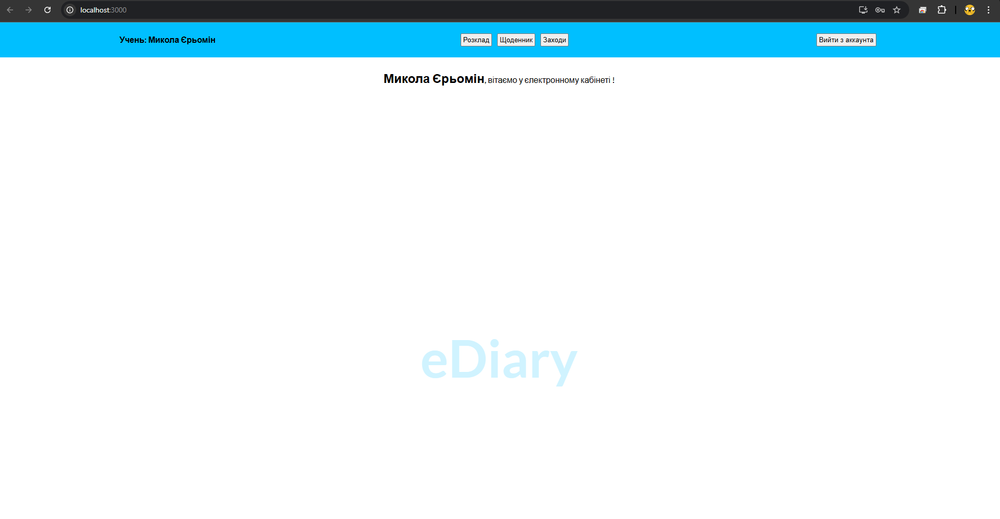
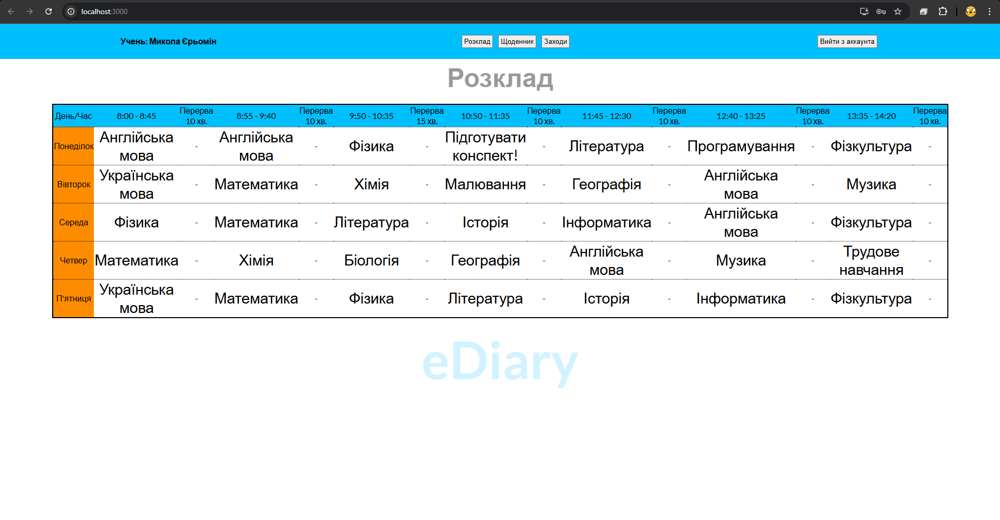
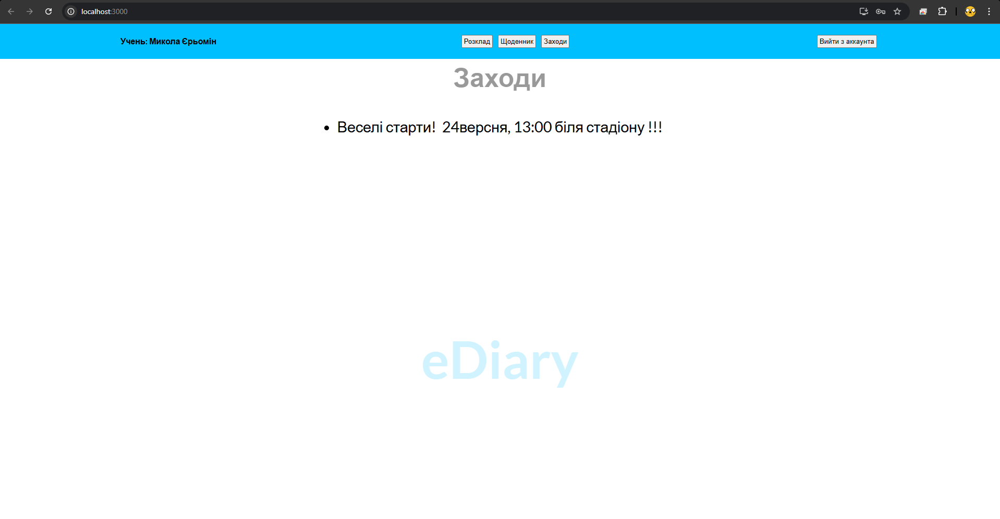

# eDiary

## 📚About the Project
***eDiary - A smart assistant to help you study effectively!***

**eDiary**- The project was created for educational purposes to improve practical skills. Its goal is to unite teachers and students and support educational activities.

## 🖥️ Demo
**An authorization form has been implemented for the user.**

After authorization, the rules for the user change slightly.

The student can only view the information. The teacher can view and edit the areas.
<p align="center">
  
</p>

**Viewing the application from the perspective of a student user:**

<p align="center>
  
  
  View of the welcome screen.

  
  View of the timetable screen.

  
  View of the diary screen.

  
  View of the events screen.
  
</p>


## 📦 Technologies

**Front-end**
- **React** - Renders the user interface.
- **JavaScript** - Implements the logic and interaction with the back-end.
- **CSS3** — Design screens.

**Back-end**
- **JavaScript** - Logic for server and connection front-end to database.
- **MongoDB** - Database (storing user data).

## 🛠️ Installation and Run Project
```bash
# Clone the repository
git clone https://github.com/NickYeromin/eDiary.git

# Run Front-End (open the root folder of the project)
npm start

# Run Back-End server (open the server folder)
node server.js

# If you runnig project in demo version database, this user data for autorization

# Student:
-Login: user123
-Password: qwerty123

#Teacher:
-Login: admin123
-Password: admin123

